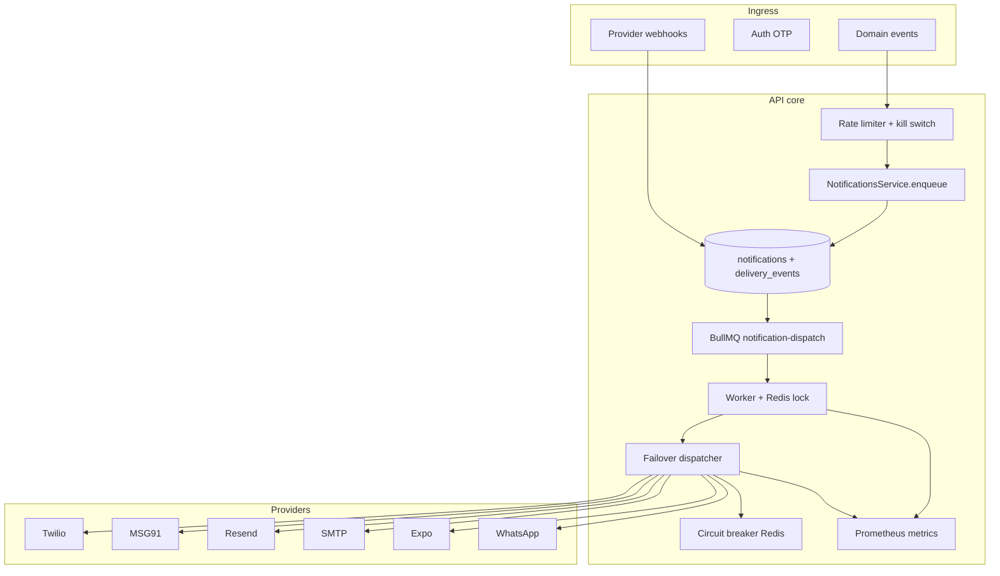

# Notification Phase 2A — Reliability & Observability

## Architecture changes



## DB schema changes

Migration: `20260515140000_notification_phase2a`

| Change | Purpose |
|--------|---------|
| `NotificationStatus`: PROCESSING, RETRYING, DLQ | Full lifecycle |
| `notifications.correlationId` | Trace enqueue → worker → webhooks |
| `notifications.processingStartedAt` | Stuck-job detection |
| `notification_delivery_events` | CRM timeline + audit |

## Queue flow

1. **Enqueue** — rate limits, idempotency unique `(tenantId, idempotencyKey, channel)`, `correlationId` assigned.
2. **Schedule** — BullMQ job with `removeOnComplete` / `removeOnFail` caps.
3. **Worker** — Redis `SET NX` lock, terminal/idempotent skip, optimistic `claimForProcessing`.
4. **Dispatch** — failover chain per channel; circuit breaker per provider.
5. **Outcome** — SENT + metrics, or RETRYING with backoff, or DLQ after `maxRetries`.

## Provider failover

| Channel | Priority 1 | Priority 2 |
|---------|------------|------------|
| SMS | Twilio | MSG91 |
| Email | Resend | SMTP (nodemailer) |
| Push | Expo | console (dev) |
| WhatsApp | Cloud API | console (dev) |

Circuit opens after `NOTIFICATION_CIRCUIT_FAILURE_THRESHOLD` failures; recovers via half-open probes after `NOTIFICATION_CIRCUIT_OPEN_MS`.

## Metrics (`GET /api/v1/notifications/admin/metrics`)

| Metric | Labels |
|--------|--------|
| `notifications_sent_total` | channel, provider, tenant_id |
| `notifications_failed_total` | channel, provider, tenant_id |
| `notification_retry_total` | channel, tenant_id |
| `notification_dlq_total` | channel, tenant_id |
| `notifications_skipped_total` | reason, channel |
| `notification_provider_latency_ms` | channel, provider |
| `notification_queue_lag_ms` | queue |

Structured logs include: `notificationId`, `correlationId`, `tenantId`, `channel`, `provider`, `retryCount`.

## Env vars

```bash
NOTIFICATION_QUEUE_ENABLED=true
NOTIFICATION_MAX_RETRIES=5
NOTIFICATION_WORKER_CONCURRENCY=8
NOTIFICATION_KILL_SWITCH=false
NOTIFICATION_CIRCUIT_FAILURE_THRESHOLD=5
NOTIFICATION_CIRCUIT_OPEN_MS=60000
NOTIFICATION_OTP_RATE_LIMIT_PER_HOUR=10
NOTIFICATION_USER_RATE_LIMIT_PER_HOUR=100
NOTIFICATION_STORM_LIMIT_PER_MINUTE=500
METRICS_ENABLED=true
TWILIO_WEBHOOK_AUTH_TOKEN=...
RESEND_WEBHOOK_SECRET=...
```

## Migration commands

```bash
pnpm --filter @ac/database exec prisma migrate deploy
pnpm --filter @ac/database exec prisma generate
pnpm --filter @ac/notifications build
pnpm --filter @ac/types build
```

## Production checklist

- [ ] Redis highly available (BullMQ + locks + circuits + rate limits)
- [ ] Scrape `/api/v1/notifications/admin/metrics` (restrict by network policy)
- [ ] Configure Twilio/Resend webhook URLs to API
- [ ] Set `NOTIFICATION_KILL_SWITCH=false` unless incident
- [ ] Alert on `notification_dlq_total` rate and open circuits
- [ ] Run load test on enqueue path; verify storm limiter

## Incident recovery

1. **Storm** — enable kill switch: `POST /api/v1/notifications/admin/kill-switch/on`
2. **DLQ** — inspect CRM DLQ panel; retry per job or fix root cause first
3. **Stuck provider** — wait for circuit recovery or pause queue, fix credentials, resume
4. **Stalled jobs** — worker uses `stalledInterval`; restart API pods for graceful drain
