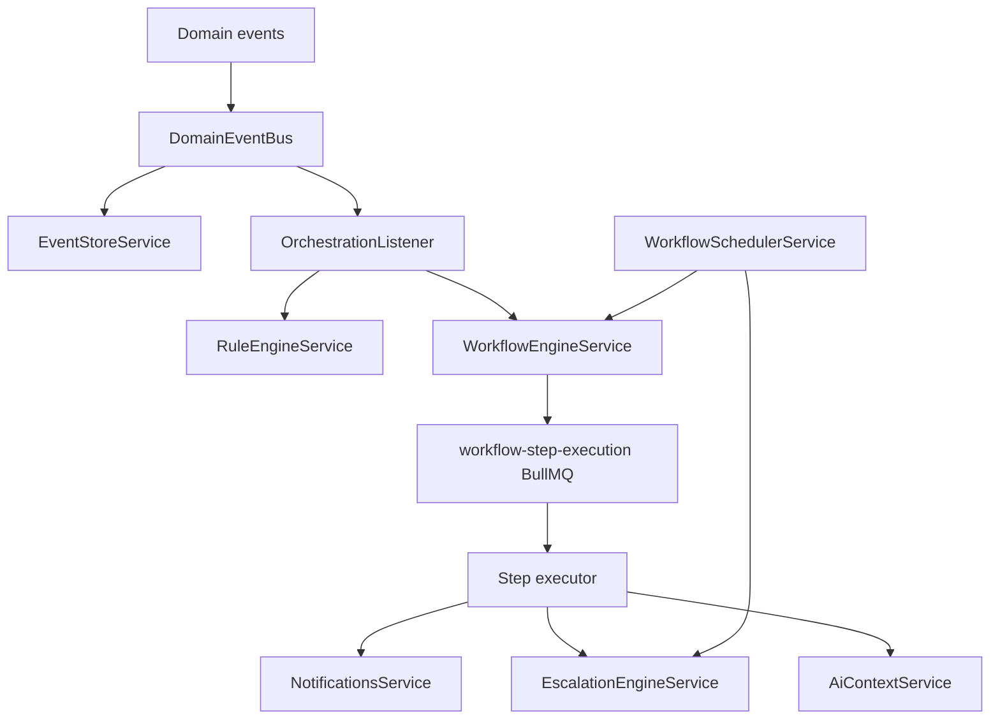

# Phase 2B — Workflow Orchestration Platform

## Architecture



## Event bus

- **Publish:** existing `DomainEventBus.publish()` unchanged for producers.
- **Persist:** `EventStoreService` writes `domain_event_records` on every publish.
- **Replay:** `GET /api/v1/orchestration/events/replay` lists envelopes; `EventStoreService.replay()` clones rows.
- **DEQ:** failed persists → Redis `domain-event-dlq`.

## Workflow engine

- Definitions in `workflow_definitions` (JSON DSL, versioned).
- Instances in `workflow_instances` with `correlationId`, `context`, `aiSnapshot`.
- Steps in `workflow_step_executions` executed via BullMQ.
- States: PENDING → RUNNING → WAITING (delays) → COMPLETED | FAILED | ESCALATED | CANCELLED.

## Scheduler

- `WorkflowSchedulerService` cron every minute: due `workflow_schedules`, SLA sweeps, stuck workflow recovery.
- Delay steps re-queue BullMQ jobs with `delayMs`.

## DB migration

```bash
pnpm --filter @ac/database exec prisma migrate deploy
pnpm --filter @ac/workflow build
```

Migration: `20260515160000_workflow_orchestration`

## API

| Method | Path | Permission |
|--------|------|------------|
| GET | `/orchestration/workflows` | workflow:view |
| GET | `/orchestration/workflows/:id/timeline` | workflow:view |
| POST | `/orchestration/workflows/:id/pause` | workflow:manage |
| POST | `/orchestration/workflows/:id/resume` | workflow:manage |
| POST | `/orchestration/workflows/:id/cancel` | workflow:manage |
| GET | `/orchestration/analytics` | workflow:view |
| GET | `/orchestration/events/replay` | automation:manage |

## Seeded workflows

- `booking-assignment` — 10m unassigned → escalate dispatch
- `invoice-overdue` — remind → wait → finance escalation
- `amc-renewal` — renewal notifications
- `customer-onboarding` — post-service follow-up + feedback

## Production scaling

- Run multiple API replicas; BullMQ ensures single step execution per job.
- Redis required for queues + event bridge.
- Tune `WORKFLOW_WORKER_CONCURRENCY` (default 4).
- Index `workflow_instances(tenantId, status, createdAt)` for CRM dashboards.

## Permissions (seed)

Add to admin roles: `workflow:view`, `workflow:manage`, `automation:manage`.
